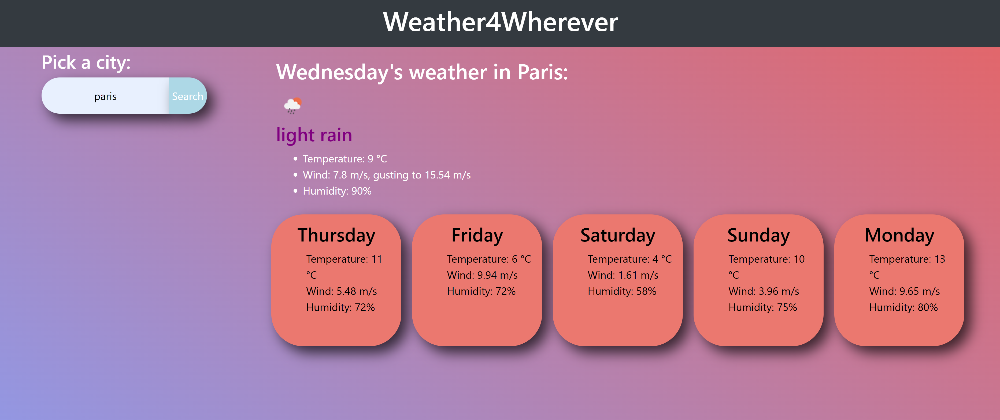

# Weather for Wherever (you like)

## Description
This is a sophisticated weather dashboard web application which uses javascript to dynamically create html elements and style them accordingly. This application also makes API calls to gather the current weather of any city, and create a 5 day forecast of the days ahead.

## Overview of deployed website:

<a href="https://cephalopodaaa.github.io/weather4wherever/index.html">click here</a> to view the page.

## Usages
Simply search for a city in the search bar and click 'search'

## License
none